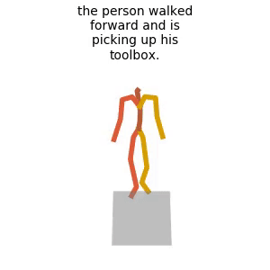

  # LoRA-MDM
  [](https://arxiv.org/abs/2503.19557)


  The official PyTorch implementation of the paper [**"Dance Like a Chicken: Low-Rank Stylization for Human Motion Diffusion"**](https://arxiv.org/abs/2503.19557).

  Please visit our [**webpage**](https://haimsaw.github.io/LoRA-MDM/) for more details.

  

  #### Bibtex
  If you find this code useful in your research, please cite:

  ```
    @misc{sawdayee2025chicken,
      title={Dance Like a Chicken: Low-Rank Stylization for Human Motion Diffusion}, 
      author={Haim Sawdayee and Chuan Guo and Guy Tevet and Bing Zhou and Jian Wang and Amit H. Bermano},
      year={2025},
      eprint={2503.19557},
      archivePrefix={arXiv},
      primaryClass={cs.CV},
      url={https://arxiv.org/abs/2503.19557}, 
  }
  ```

  ## Getting started

  This code was tested on `Ubuntu 18.04.5 LTS` and requires:

  * Python 3.7
  * conda3 or miniconda3
  * CUDA capable GPU (one is enough)

  ### 1. Setup environment

  Install ffmpeg (if not already installed):

  ```shell
  sudo apt update
  sudo apt install ffmpeg
  ```
  For windows use [this](https://www.geeksforgeeks.org/how-to-install-ffmpeg-on-windows/) instead.

  Setup conda env:
  ```shell
  conda env create -f environment.yml
  conda activate lora_mdm
  python -m spacy download en_core_web_sm
  pip install git+https://github.com/openai/CLIP.git
  ```

  Download dependencies:

  ```bash
  bash prepare/download_smpl_files.sh
  bash prepare/download_glove.sh
  bash prepare/download_t2m_evaluators.sh
  ```

  ### 2. Get data

  <details>
    <summary><b>Style Data</b></summary>
  Get the retargeted 100STYLE dataset from [here](https://github.com/neu-vi/SMooDi) and extract the dataset into dataset/100STYLE-SMPL directory
  </details>

  <details>
    <summary><b>Text to Motion</b></summary>

  download the [HumanML3d dataset](https://drive.google.com/drive/folders/1OZrTlAGRvLjXhXwnRiOC-oxYry1vf-Uu?usp=drive_link) and place them it in `.dataset/HumanML3D`. 

  ### 3. Download the pretrained models

  Download the model(s) you wish to use from this [Drive](https://drive.google.com/drive/folders/1_YpQ9cLMBVvBhAXCTEcsIen1NkpS6UYL?usp=sharing), then unzip and place them in `./save/`. 


  ## Motion Synthesis

  ### Generate from test set prompts

  ```shell
  python -m sample.generate  --lora_finetune --model_path save/mdm/model000500000.pt --styles Chicken --num_samples 10 --num_repetitions 3 --output_dir 'save/out/' 
  ```

  ### Generate from your text file

  ```shell
  python -m sample.generate  --lora_finetune --model_path save/mdm/model000500000.pt --styles Chicken --input_text ./assets/example_text_prompts.txt --output_dir 'save/out/' 
  ```

  ### Generate a single prompt

  ```shell
  python -m sample.generate  --lora_finetune --model_path save/mdm/model000500000.pt --styles Chicken --output_dir 'save/out/' --text_prompt "A person is kicking in sks style."
  ```

  **Notes:**
  * `--styles` can be either a style name or a path
  * Text prompts should end with 'in sks style.'


  **You may also define:**
  * `--device` id.
  * `--seed` to sample different prompts.
  * `--motion_length` (text-to-motion only) in seconds (maximum is 9.8[sec]).

  **Running those will get you:**

  * `results.npy` file with text prompts and xyz positions of the generated animation
  * `sample##_rep##.mp4` - a stick figure animation for each generated motion.

  It will look something like this:

  

  You can stop here, or render the SMPL mesh using the following script.

  ### Render SMPL mesh

  To create SMPL mesh per frame run:

  ```shell
  python -m visualize.render_mesh --input_path /path/to/mp4/stick/figure/file
  ```

  **This script outputs:**
  * `sample##_rep##_smpl_params.npy` - SMPL parameters (thetas, root translations, vertices and faces)
  * `sample##_rep##_obj` - Mesh per frame in `.obj` format.

  **Notes:**
  * The `.obj` can be integrated into Blender/Maya/3DS-MAX and rendered using them.
  * This script is running [SMPLify](https://smplify.is.tue.mpg.de/) and needs GPU as well (can be specified with the `--device` flag).
  * **Important** - Do not change the original `.mp4` path before running the script.

  **Notes for 3d makers:**
  * You have two ways to animate the sequence:
    1. Use the [SMPL add-on](https://smpl.is.tue.mpg.de/index.html) and the theta parameters saved to `sample##_rep##_smpl_params.npy` (we always use beta=0 and the gender-neutral model).
    1. A more straightforward way is using the mesh data itself. All meshes have the same topology (SMPL), so you just need to keyframe vertex locations. 
      Since the OBJs are not preserving vertices order, we also save this data to the `sample##_rep##_smpl_params.npy` file for your convenience.

  ## Train your own MDM and LoRA

  <details>
    <summary><b>Text to Motion</b></summary>

  ```shell
  python -m train.train_mdm --save_dir save/mdm --dataset humanml --diffusion_steps 100 --arch trans_dec --text_encoder_type bert --mask_frames --lambda_prior_preserv 0.0
  ```
  </details>

  <details>
    <summary><b>LoRA Adapters</b></summary>
    
    ```shell
    python -m train.train_mdm --save_dir save/lora/Chicken --num_steps 4000 --diffusion_steps 1000 --dataset 100style --arch trans_dec --text_encoder_type bert --starting_checkpoint save/mdm/model000500000.pt --styles Chicken --lora_finetune --mask_frames
    ```
    * For evaluation use `--lambda_prior_preserv 0.25`
  </details>

  * Use `--device` to define GPU id.
  * Use `--arch` to choose one of the architectures reported in the paper `{trans_enc, trans_dec}` (`trans_enc` is default).
  * Add `--train_platform_type {ClearmlPlatform, TensorboardPlatform}` to track results with either [ClearML](https://clear.ml/) or [Tensorboard](https://www.tensorflow.org/tensorboard).
  * Add `--eval_during_training` to run a short (90 minutes) evaluation for each saved checkpoint. 
    This will slow down training but will give you better monitoring.

  ## Evaluate

  ```shell
  python  -m eval.eval_lora_mdm --model_path  save/mdm/model000500000.pt --lora_finetune --lora_rank 5 --arch trans_dec --text_encoder_type bert --classifier_style_group All
  ```

  ## Acknowledgments

  This code is standing on the shoulders of giants. We want to thank the following contributors
  that our code is based on:

  [MDM](https://github.com/GuyTevet/motion-diffusion-model),
  [lora-pytorch](https://github.com/fkodom/lora-pytorch),
  [SMooDi](https://github.com/neu-vi/SMooDi),
  [MotionCLIP](https://github.com/GuyTevet/MotionCLIP), [text-to-motion](https://github.com/EricGuo5513/text-to-motion), [actor](https://github.com/Mathux/ACTOR), [joints2smpl](https://github.com/wangsen1312/joints2smpl), [MoDi](https://github.com/sigal-raab/MoDi).

  ## License
  This code is distributed under an [MIT LICENSE](LICENSE).

  Note that our code depends on other libraries, including CLIP, SMPL, SMPL-X, PyTorch3D, and uses datasets that each have their own respective licenses that must also be followed.
